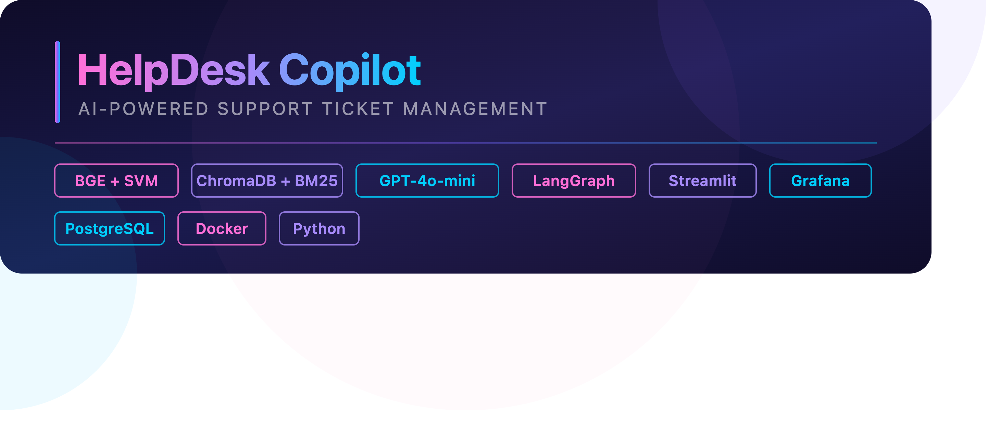
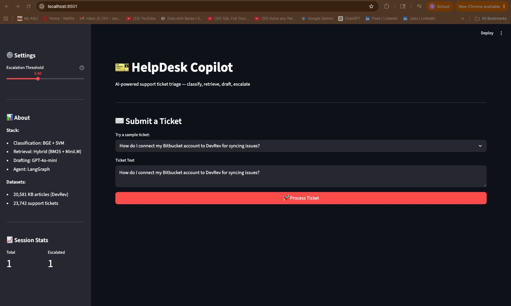
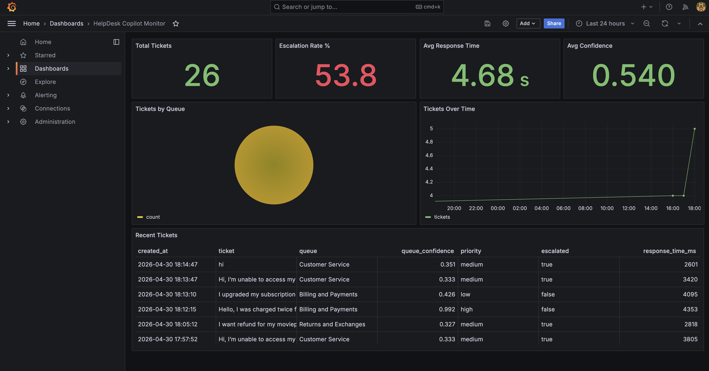

# 🎫 HelpDesk Copilot

> An AI-powered support ticket management system with hybrid RAG retrieval, multi-model classifier comparison, and human-in-the-loop review.


---

## 📽️ Demo

▶️ [Watch Demo Video](https://youtu.be/KNhflbtzGpA)

> Shows the full pipeline: ticket submission → classification → hybrid retrieval → GPT-4o-mini draft → Streamlit dashboard → Grafana monitoring

---

## 🧠 What It Does

SaaS support teams handle hundreds of tickets daily — each requiring manual reading, routing, doc search, and reply drafting. **HelpDesk Copilot** automates the repetitive parts while keeping a human agent in the loop for final approval.

A **4-stage AI pipeline** processes every incoming ticket:

```
Incoming Ticket
     │
     ▼
┌─────────────┐     ┌──────────────┐     ┌─────────────────┐     ┌──────────────────┐
│  Stage 1    │────▶│   Stage 2    │────▶│    Stage 3      │────▶│    Stage 4       │
│  Classify   │     │   Retrieve   │     │  Draft Reply    │     │  Human Review    │
│ BGE + SVM   │     │ BM25+Vector  │     │  GPT-4o-mini    │     │ Streamlit + HITL │
└─────────────┘     └──────────────┘     └─────────────────┘     └──────────────────┘
     │
     ▼
Confidence < 0.40 → Auto-Escalate + [NEEDS REVIEW] flag
```

---

## 🏗️ System Architecture



### Stage 1 — Triage Classification
Three approaches were compared on 23,742 English support tickets across 10 queue categories and 5 priority levels:

| Model | Queue Macro-F1 | Priority Macro-F1 |
|---|---|---|
| TF-IDF + Logistic Regression | 0.60 | 0.63 |
| SetFit (MiniLM-L6-v2, few-shot) | 0.25 | — |
| **BGE-small-en-v1.5 + SVM** ✅ | **0.63** | **0.69** |

BGE+SVM won — dense embeddings capture semantic relationships (e.g. "charged twice" ≈ "duplicate payment") that TF-IDF misses. Platt scaling calibrates confidence scores for reliable escalation decisions.

### Stage 2 — Hybrid RAG Retrieval
Knowledge base: **20,581 article chunks** (cleaned from 65,224 raw DevRev docs).

| Method | Hit@1 | Hit@5 | Hit@10 | MRR |
|---|---|---|---|---|
| Vector only (MiniLM) | 0.275 | 0.488 | 0.601 | 0.364 |
| **Hybrid (BM25 + Vector)** ✅ | 0.268 | **0.516** | 0.598 | **0.365** |

Fusion weights: **40% BM25 + 60% vector similarity**. Top 5 articles returned per query.

### Stage 3 — LLM Draft Generation
GPT-4o-mini (temp=0.3) generates grounded replies using only retrieved KB articles. Constrained to <200 words, prevents hallucination by design.

### Stage 4 — LangGraph Agent + Human Review
Stateful directed graph with 4 nodes: `classify → retrieve → draft | escalate`. Confidence threshold of **0.40** routes tickets automatically. All reasoning steps visible on the dashboard.

---

## 📊 Results

| Metric | Value |
|---|---|
| Response relevance (RELEVANT) | 63.6% |
| User feedback positive rating | **82%** |
| Avg response time | 1.2 – 1.8 seconds |
| API cost per ticket | < $0.001 |
| Avg tokens per request | ~1,150 – 1,220 |

---

## 🖥️ Dashboard



The Streamlit dashboard shows per ticket:
- Predicted queue + priority with confidence %
- Draft reply grounded in KB articles
- Retrieved articles with relevance scores
- Agent reasoning chain
- Approve / Edit / Escalate action buttons
- Adjustable confidence threshold slider

---

## 📈 Monitoring



Grafana connects to PostgreSQL and tracks in real time:
- Response relevance distribution (RELEVANT / PARTLY / NON-RELEVANT)
- Feedback ratings (👍 / 👎)
- Response time trends
- Cumulative OpenAI API cost
- Token usage per request

---

## 🗂️ Project Structure

```
helpdesk-copilot/
├── src/
│   ├── classifier/
│   │   ├── train_baseline.py           # TF-IDF + Logistic Regression
│   │   └── train_bge_svm.py            # BGE-small-en-v1.5 + SVM (final model)
│   ├── retrieval/
│   │   ├── ingest.py                   # ChromaDB ingestion pipeline
│   │   ├── hybrid_search.py            # BM25 + vector hybrid retrieval
│   │   ├── eval_retrieval.py           # Vector-only retrieval evaluation
│   │   └── eval_retrieval_hybrid.py    # Hybrid retrieval evaluation
│   ├── agent/
│   │   └── langgraph_agent.py          # LangGraph orchestration
│   ├── dashboard/
│   │   └── streamlit_app.py            # Streamlit HITL dashboard
│   └── database/
│       ├── db.py                       # PostgreSQL logging
│       └── data_prep.py                # DB initialization
├── notebooks/
│   ├── 01_data_exploration.ipynb
│   ├── 02_data_cleaning.ipynb
│   └── 03_evaluation_data_generation.ipynb
├── monitoring/
│   └── grafana/
│       └── dashboard.json
├── images/
├── docker-compose.yml
├── requirements.txt
├── .env.template
├── .gitignore
└── README.md
```

---

## 🚀 Getting Started

### Prerequisites
- Python 3.10+
- Docker & Docker Compose
- OpenAI API key

### 1. Clone & install
```bash
git clone https://github.com/SowjanyaAnchula/Helpdesk-COpilot.git
cd Helpdesk-COpilot
pip install -r requirements.txt
```

### 2. Configure environment
```bash
cp .env.template .env
# Fill in your OPENAI_API_KEY and Postgres credentials
```

### 3. Start PostgreSQL
```bash
docker-compose up -d postgres
python src/database/data_prep.py
```

### 4. Ingest knowledge base
```bash
python src/retrieval/ingest.py
```

### 5. Run the dashboard
```bash
streamlit run src/dashboard/streamlit_app.py
```

### 6. Start Grafana monitoring
```bash
docker-compose up -d grafana
# Visit http://localhost:3000
```

---

## 🧪 Datasets

| Dataset | Source | Size |
|---|---|---|
| Knowledge Base | [DevRev Search (HuggingFace)](https://huggingface.co/datasets/devrev/search) | 65,224 chunks → 20,581 after cleaning |
| Support Tickets | [Tobi-Bueck (HuggingFace)](https://huggingface.co/datasets/Tobi-Bueck/customer-support-tickets) | 61,765 tickets → 23,742 English used |

---

## 🛠️ Tech Stack

| Component | Technology |
|---|---|
| Classification | BGE-small-en-v1.5 + SVM, TF-IDF + Logistic Regression |
| Vector DB | ChromaDB (HNSW, cosine similarity) |
| Keyword Search | BM25-Okapi |
| LLM | GPT-4o-mini (OpenAI) |
| Agent Orchestration | LangGraph |
| Frontend | Streamlit |
| Database | PostgreSQL |
| Monitoring | Grafana |
| Containerization | Docker |

---

## Conclusion

HelpDesk Copilot demonstrates that AI can meaningfully assist support teams without replacing human judgment. The key findings:

- **BGE + SVM outperformed** TF-IDF and few-shot SetFit for ticket classification, confirming that dense semantic embeddings handle the nuance of support language better than keyword frequency alone.
- **Hybrid retrieval (BM25 + vector)** improved Hit@5 over vector-only search, with data deduplication proving to be the single biggest retrieval improvement — a practical reminder that data quality matters more than model complexity.
- **GPT-4o-mini with grounded prompting** kept hallucination in check while staying under $0.001 per ticket, making the system production-viable.
- **LangGraph's confidence-based routing** provided transparent, controllable escalation — agents always know why a ticket was flagged.
- **82% positive user feedback** and sub-2-second response times validate the system as a practical productivity tool, not just a research prototype.

The architecture is intentionally domain-portable. With different datasets it could be adapted to university helpdesks, IT service management, or any internal support context.

---

## 🔭 Future Work

- **Active learning** — use escalated tickets as new labeled training data to continuously improve classification accuracy over time
- **Open-source LLM fine-tuning** — fine-tune a smaller model (e.g. Mistral-7B) on ticket-response pairs to eliminate OpenAI API dependency and reduce operational costs
- **Multilingual expansion** — extend classification and retrieval to support languages beyond English and German
- **Threshold optimization** — systematically optimize the 0.40 confidence threshold using precision-recall tradeoff analysis rather than manual tuning
- **University helpdesk adaptation** — adapt the pipeline for ASU use cases including financial aid, housing, and registrar services

---

## Acknowledgements

- [DevRev](https://huggingface.co/datasets/devrev/search) for the knowledge base dataset
- [Tobi-Bueck](https://huggingface.co/datasets/Tobi-Bueck/customer-support-tickets) for the support ticket dataset
- The open-source community behind HuggingFace, LangGraph, ChromaDB, Sentence Transformers, and Streamlit
- Arizona State University — FSE 570 course instructors and teaching assistants for guidance throughout the project